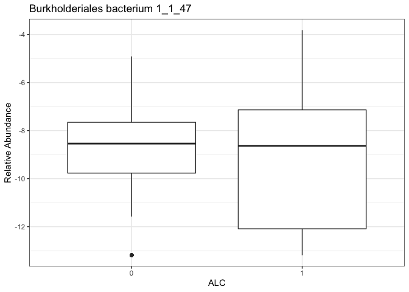

<!-- README.md is generated from README.Rmd. Please edit that file -->

# ZIPG

<!-- badges: start -->
<!-- badges: end -->

We provide R code for Zero-inflated Poisson-Gamma Model (ZIPG) with an
application to longitudinal microbiome count data.

## Installation

You can install the development version of ZIPG like so:

``` r
devtools::install_github("roulan2000/ZIPG")
```

## Example

### Load Data

Load dietary data. Complete Dietary data can be found in “Daily sampling
reveals personalized diet-microbiome associations in humans.” (Johnson
et al. 2019)

``` r
library(ZIPG)
library(ggplot2)
data("Dietary")
dat = Dietary
taxa_num = 100
dat$taxa_name[taxa_num] # taxa name
#>                             OTU100 
#> "Burkholderiales bacterium 1_1_47"
W = dat$OTU[,taxa_num] # taxa count
M = dat$M # sequencing depth
ggplot(NULL)+
  geom_boxplot(aes(
  x = as.factor(dat$COV$ALC01),y=log((W+0.5)/M)))+
  labs(title = dat$taxa_name[taxa_num],
       x = 'ALC',y='Relative Abundance')+
  theme_bw()
```



## ZIPG Wald

Use function `ZIPG_main()` to run our ZIPG model.

**Input :**

`W` : Observed taxa count data.

`M` : Sequencing depth, ZIPG use log(M) as offset by default.

`X`, `X_star` : Covariates of interesting of differential abundance and
differential varibility, input as formula.

**Output list:**

`ZIPG_res$init` : pscl results, used as initialization.

`ZIPG_res$res` : ZIPG output evaluated at last EM iteration.

`ZIPG_res$res$par` : ZIPG estimation for
$\Omega = (\beta,\beta^*,\gamma)$.

`ZIPG_res$wald_test` : ZIPG Wald test

`ZIPG_res$logli` : ZIPG log-likelihood

``` r
ZIPG_res <- ZIPG_main(data = dat$COV,
                      X = ~ALC01+nutrPC1+nutrPC2, X_star = ~ ALC01,
                      W = W, M = M)
res = ZIPG_summary(ZIPG_res)
#>           ZIPG Wald  
#>        Estimation     SE     pval    
#> beta0      -7.371 0.1512 0.00e+00 ***
#> beta1       0.121 0.1985 5.41e-01    
#> beta2       0.106 0.0188 1.41e-08 ***
#> beta3      -0.118 0.0287 4.17e-05 ***
#> beta0*      0.525 0.1199 1.20e-05 ***
#> beta1*      0.606 0.1406 1.63e-05 ***
#> gamma      -2.080 0.1460 4.93e-46 ***
```

## ZIPG bWald

Set the bootstrap replicates `B` in `bWald_list` to conduct ZIPG-bWald,
results and covariance matrix can be find in `ZIPG_res$bWald`.

``` r
set.seed(123)
# Set bootstrap replicates B
bWald_list = list(B = 100)
# Wait for a wile
ZIPG_res1 = ZIPG_main(
  data = dat$COV,
  X = ~ALC01+nutrPC1+nutrPC2, X_star = ~ ALC01,
  W = W, M = M,
  bWald_list = bWald_list)
#> Running non-parametric bootstrap wald test
#> Finish
res = ZIPG_summary(ZIPG_res1,type = 'bWald')
#>           ZIPG bWald   
#>        Estimation     SE     pval    
#> beta0      -7.371 0.1896 0.00e+00 ***
#> beta1       0.121 0.2323 6.01e-01    
#> beta2       0.106 0.0209 3.51e-07 ***
#> beta3      -0.118 0.0342 5.95e-04 ***
#> beta0*      0.525 0.1283 4.30e-05 ***
#> beta1*      0.606 0.1740 4.97e-04 ***
#> gamma      -2.080 0.3698 1.86e-08 ***
res = ZIPG_CI(ZIPG_res1,type='bWald',alpha = 0.05)
#>         ZIPG Wald Confidence interval 
#>        Estimation      lb      ub
#> beta0      -7.371 -7.7421 -6.9990
#> beta1       0.121 -0.3338  0.5768
#> beta2       0.106  0.0655  0.1474
#> beta3      -0.118 -0.1847 -0.0505
#> beta0*      0.525  0.2734  0.7765
#> beta1*      0.606  0.2649  0.9470
#> gamma      -2.080 -2.8046 -1.3551
```

To test more complicated hypothesis, you may use the covariance matirx
driven from bootstrap.

``` r
round(ZIPG_res1$bWald$vcov,3)
#>        [,1]   [,2]   [,3]   [,4]   [,5]   [,6]   [,7]
#> [1,]  0.036 -0.040  0.001  0.003  0.005 -0.009  0.013
#> [2,] -0.040  0.054 -0.001 -0.004 -0.006  0.009 -0.008
#> [3,]  0.001 -0.001  0.000  0.000  0.000  0.001 -0.001
#> [4,]  0.003 -0.004  0.000  0.001  0.001 -0.002  0.003
#> [5,]  0.005 -0.006  0.000  0.001  0.016 -0.014 -0.012
#> [6,] -0.009  0.009  0.001 -0.002 -0.014  0.030 -0.025
#> [7,]  0.013 -0.008 -0.001  0.003 -0.012 -0.025  0.137
```

## ZIPG pbWald

Set bootstrap replicates `B` and the null hypothesis by formula `X0` and
`X_star0` in `pbWald_list` to conduct ZIPG-pbWald, results can be find
in ZIPG_res\$pbWald

``` r
# test beta1star, the 6th parameter
# 
pbWald_list = list(
  X0 = ~ALC01 + nutrPC1+nutrPC2,
  X_star0 = ~ 1,
  B = 100
)

ZIPG_res2 = ZIPG_main(
  data = dat$COV,
  X = ~ALC01+nutrPC1+nutrPC2, X_star = ~ ALC01,
  W = W, M = M,
  pbWald_list= pbWald_list)
#> Running parametric bootstrap wald test
#> Finish

res = ZIPG_summary(ZIPG_res2,type ='pbWald')
#>    ZIPG pbWald 
#>  H0: beta1* = 0 
#>  pvalue =  0.0099
```

# References

-   Jiang, Roulan, Xiang Zhan, and Tianying Wang. [“A Flexible
    Zero-Inflated Poisson-Gamma Model with Application to Microbiome
    Sequence Count
    Data.”](https://doi.org/10.1080/01621459.2022.2151447) Journal of
    the American Statistical Association (2023): 1-13.
